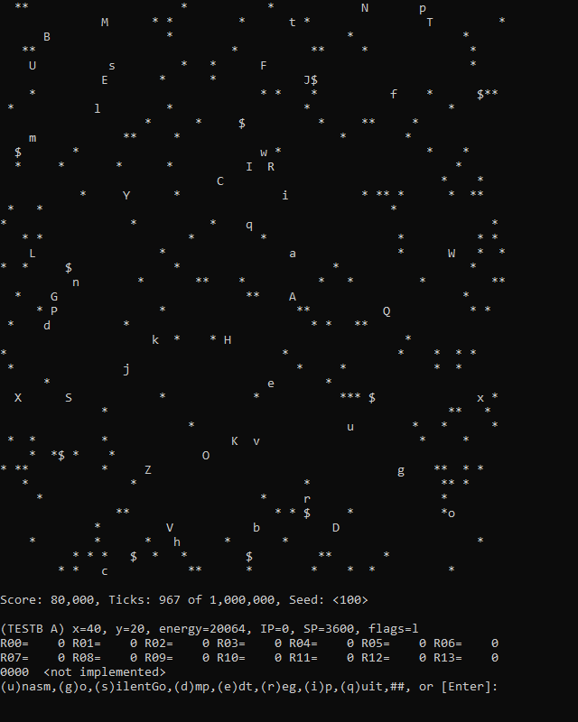

# OpenNANORGS

A (very poor) .NET 7.0 reimplementation of Symantec's 2006
University Programming Competition virtual nano-organism simulator.

*A project born out of intrigue, minor obsession, frustration and inspriration.* 

### Seeds will never produce an identical result to the original version!

## Story

If you'll indulge me for a moment, there's a bit of a story behind this,
and I'd feel bad if I didn't share it with the world.

Hi, I'm [Yellowberry](https://github.com/YellowberryHN), and this is
the story of [OpenNANORGS](https://github.com/YellowberryHN/OpenNANORGS).

[Many moons ago](# "apparently sometime around 1384988829"), a younger me
was looking for a science fair project, but, I wanted to do something special,
something different. I had been interested in programming for about 3-5 years
at this point, and I wanted to see if I could combine my interest in programming
with a cool science fair project. I was scouring the internet until a project on
some random [science fair project idea][1] website caught my eye. The premise had
me immediately intrigued, and although it sounded hard, I knew I could at least
try to work with it. I downloaded the project files and immediately got to work.

After digging through the included documentation, I realized this was going to be
much more difficult than I anticipated, and I started having my doubts. As someone
who had up until that point only had experience with very high level languages like
Lua, it was difficult to wrap my head around.

***COMPLETE STORY EVENTUALLY***

[1]: <https://www.sciencebuddies.org/science-fair-projects/project-ideas/CompSci_p021/computer-science/programming-nanorgs-in-a-virtual-world> "Programming NANORGs in a Virtual World"

## Screenshots

###### A WIP version of the playfield and single-step debugger.

## Contributing

## Samples Bots

There are some bot examples and samples in the "[bots/](../../blob/master/bots)" folder of this repo.
I have gathered all of the bot code I could from the internet and dumped it in here. 
If I've put your bot here, and you don't want it to be included, reach out and I'll remove it.

That being said, all bots credited to Yellowberry or Zsolt Zitting are mine,
and are licensed under the [CC0 license](https://creativecommons.org/publicdomain/zero/1.0/).

If you write bots and release them to the public, I encourage you to also use the CC0 license.

## License 

**OpenNANORGS** is licensed under the permissive [MIT license](https://choosealicense.com/licenses/mit/).

## Disclaimer

Some of the material found in this repo **(not the code)** may be Copyright &copy; 2006, Symantec Corporation

If you (Symantec Corporation), have concerns about your material being included in this repo, please reach out to me.
